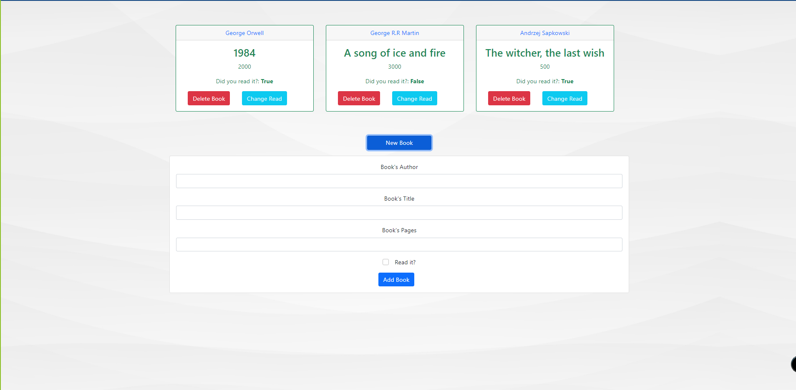

# Javascript Library

> This is a library Web-App made with Javascript and Bootstrap 5 where the user can add information about books, delte created books, andedit the status if the user has already read it. 

# Application Screenshot


## Built With

- HTML
- CSS
- Bootstrap 5
- Javascript

## Live Demo

You can visit [here]() our app.

## Getting Started

To get a local copy up and running follow these simple example steps:

- Clone this repository with:
```
   https://github.com/GabrielJSuarez/JS-library.git
```
- Open the project folder where the repository was downloaded.
- Open the *index.html* file with your live server.
- Start creating books.

## Prerequisites

- Web Browser
- Internet conection

### Instructions

1. Click on *New Book* button.
2. Fill the form with the information of the book you want to add.
3. Click the *Add Book* button to save the book.
4. You can change the read status by clicking *Change Read*.

## Authors

👤 **Alexisbec**
- Github: [@alexisbec](https://github.com/alexisbec)
- Linkedin: [Alexis Varela](www.linkedin.com/in/alexbec)
- Twitter : [@AlexisV31667779](https://twitter.com/AlexisV31667779)

👤 **Gabriel Suarez**
- Github: [@ginnandjuice](https://github.com/ginnandjuice)
- Twitter: [@fatbaxxter](https://twitter.com/fatbaxxter)
- Linkedin: [Gabriel Suárez](https://www.linkedin.com/in/gabriel-ginn-suarez/)


## 🤝 Contributing

Contributions, issues, and feature requests are welcome!

## Show your support

Give a ⭐️ if you like this project!

## 📝 License

This project is [MIT](https://github.com/GabrielJSuarez/JS-library/blob/development/LICENSE.txt) licensed.